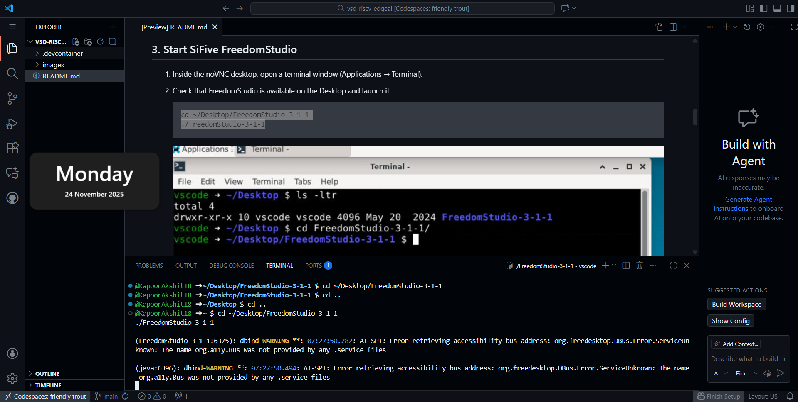
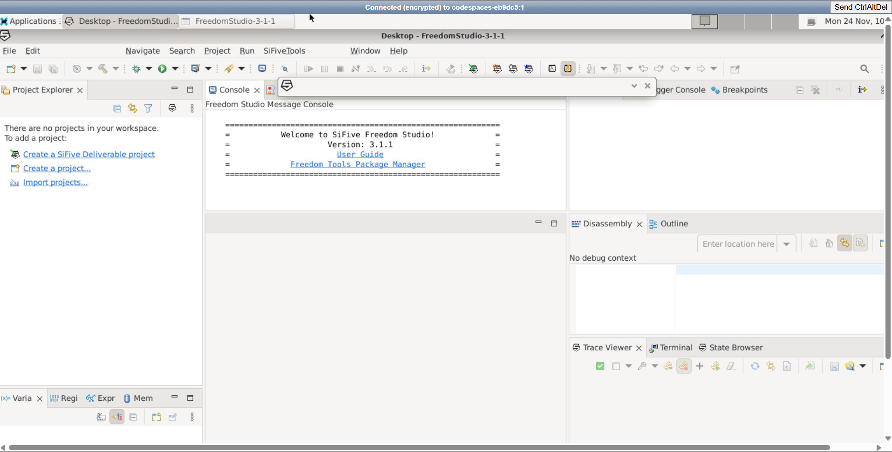
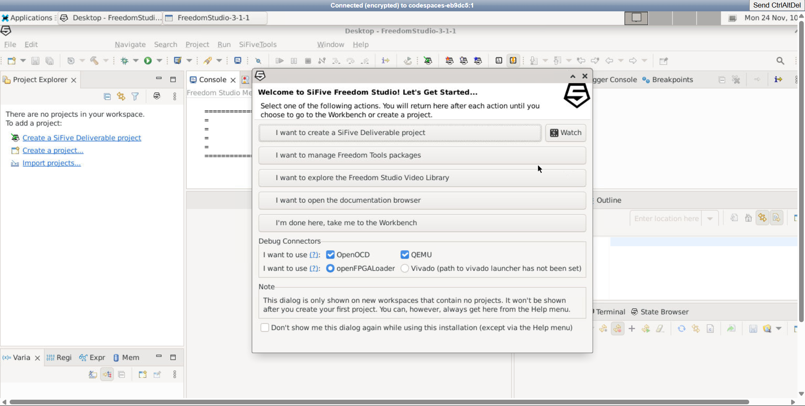

# VSD-Real-World-Edge-AI-Lab  
<details>
<summary>     

## Program tools and Structure    

</summary>  

  
  The program is of 10 days with assignments. VSD Workshops are intense and industry focused and provides latest hardware related programs. 

    

---  
### Furthermore for this workshop we have used the following tools:   

- **Freedom Studio**  

Freedom Studio = SiFive’s official Eclipse-based IDE for RISC-V programming and debugging. It is tool used for our project, an Integrated Development Environment (IDE) provided by SiFive for developing software on RISC-V–based processors.    
✅ What Freedom Studio Includes

- A customized Eclipse-based IDE
- GNU GCC toolchain for RISC-V
- OpenOCD for debugging
- SDKs for SiFive Freedom platforms
- Also, Support for writing, building, and debugging C/C++ applications on RISC-V cores

✅ Where It Is Used

 <li>RISC-V learning and experimentation
 Edge AI or embedded system development (if using RISC-V boards)
 Programming SiFive boards such as HiFive1, HiFive Unleashed, etc.
</li>

Here’s a clear **Markdown write-up** about **GitHub Codespaces** and **VMC setup** (Virtual Machine Configuration) inside it, ready for lab or project reports.

---

# 🧩 GitHub Codespaces and VMC Setup

## 1. **GitHub Codespaces**

**GitHub Codespaces** is a **cloud-based development environment** provided by GitHub. It allows developers to write, run, and debug code directly in the browser using a Visual Studio Code–like interface. It provides a powerful browser-based development platform, while VMC setup allows users to configure the underlying virtual machine according to project needs. Together, they offer a flexible, scalable, and hardware-independent development environment.


### Key Features

* Fully cloud-hosted VS Code environment
* Pre-configured development containers
* Automatic dependency installation
* Terminal access inside the browser
* Seamless integration with GitHub repositories

### Benefits

* No local system setup required
* Works on any device with a browser
* Fast onboarding for new projects
* Safe isolated development environment

---

## 2. **What is VMC Setup in Codespaces?**

**VMC (Virtual Machine Configuration)** setup refers to configuring the **cloud virtual machine environment** that powers the Codespace.

Each Codespace runs inside a **Linux-based virtual machine** that can be customized for:

* CPU cores
* RAM size
* Storage space
* Installed software

This setup makes Codespaces behave like a personal virtual computer running inside the cloud.

---

<details><summary> Optional for self-projects</summary>  
   
## 3. **Steps Involved in VMC Setup inside GitHub Codespaces**

### Step 1: Creating a Codespace

* Open a GitHub repository
* Click **Code → Codespaces → Create Codespace**

### Step 2: Selecting Machine Type (VMC Configuration)

You can choose the VM specifications:

* Number of cores (2-core, 4-core, etc.)
* RAM size
* Disk space

### Step 3: Configuring the Virtual Environment

A `devcontainer.json` file is used to define:

* Base OS image (Ubuntu, Debian, etc.)
* Tools and libraries to install
* VS Code extensions

Example configuration:

```json
{
  "name": "Linux Dev VM",
  "image": "mcr.microsoft.com/devcontainers/base:ubuntu",
  "features": {
    "python": "latest"
  }
}
```

---

## 4. **Software Installation in VMC**

Inside the Codespace terminal, you can install tools like:

```bash
sudo apt update
sudo apt install python3 git build-essential
```

This effectively customizes your **virtual machine setup**.

---
</details>  

## 5. **Use Cases of GitHub Codespaces with VMC**

* AI and Machine Learning projects
* Web and app development
* Embedded systems simulation
* Cloud-native application testing

---


</details>
  
##  Execution of the Program Flow

1. Setting Up the Environment.

We used GitHub codespace for cloud based lab. The steps are simple as follows:

	1.Open the git hub link provided by vsd: 
	2.Click on green code button and find out the create codespace on main option.
	3.Wait for a few seconds and VSCode like tab will open.
	4. Now find the Internet symbol within Ports and forwarded address so, to open noVNC 	   Desktop.
	5. As we step into the environment (as seen in the image below) and have opened the novnc webpage, we can add the following commands:  

```
#To change the directory to the Freedom Studio's Directory
cd ~/Desktop/FreedomStudio-3-1-1
#Opening the Freedom Studio
./FreedomStudio 3-1-1

```
  
Output would be:

 
   
 
6. After that I click on vnc.html inside the webpage as seen in the fourth image just above. And click on connect.  

 
 

7. Once the session gets connected and opened, go to the freedom studio folder present in the homepage, and open Freedom Studio from there, I had modified the workspace directory, to the default `/home/vscode/Desktop`. 

  

   

8. After exploring the option select I'm done here, take me to the workbench and we will proceed with our second part of this section where we will make example project in the eclipse IDE.      

 
  
---
 <details>    

 9. Tips for Smooth Operation    


* Use a Chromium-based browser (Chrome or Edge) for better VNC responsiveness.
* Avoid closing the Codespace tab while FreedomStudio is running.
* All files in /home/vscode/Desktop persist while the Codespace is active.
* If the desktop view appears blank, refresh the noVNC tab once after the Codespace boots.  

10. Troubleshooting     

```
#Sourced from #https://github.com/vsdip/vsd-riscv
-edgeai

Issue Port 6080 does not appear	
Solution Wait for setup to complete (~2–3 min). Refresh PORTS tab.  

noVNC window is blank
Refresh browser tab or reopen from PORTS list.  

FreedomStudio not found	Run 
setup manually or restart Codespace.  

Workspace prompt reappears each time	  
Select "Use this as default and do not ask again" before launching.</details>   


```
---  
  
 2. Example project on the Eclipse IDE. 
(coming soon), feel free to explore other project related directories present here.
  </details>
  
## Acknowledgements    

Kunal Ghosh Sir, Ankit Mawle Sir and Dhavanti Bhavsar Madam.  

---

